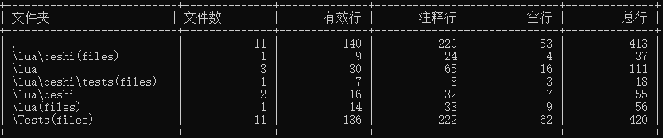

# 代码统计工具开发日志

---

## 10月25日

- **功能实现**：对给定的目录进行遍历，获得所有文件的路径。（默认用户输入的是文件夹路径）

---

## 10月26日

- **功能实现**：对文件实现简单的统计代码行量，包括代码的总行数和空行数。

---

## 10月27日

- **功能拆分**：把统计代码的功能独立出来。
- **功能实现**：实现统计注释行数。
- **现存问题（已解决）**：处理注释内包含"//"和注释在代码后面的情况，如 `let commentLineCount = 0; // 注释行数`。

---

## 10月28日

- **问题解决**：解决10月27日遗留的问题。
- **功能实现**：完成对七大编程语言（Java、XML、Python、C#、PHP、JavaScript、CSS）的单行和多行注释的统计。

---

## 10月29日

- **功能优化**：对Lua、HTML文件的注释正则匹配进行调整，并正确统计注释行数。
- **功能增强**：对目录的输入方式进行优化，允许用户自己输入目录。
- **逻辑判断**：对用户输入的目录进行判断，如果是文件夹则继续处理，如果是文件则直接进行统计。

---

## 10月30日

- **代码重构**：把文件注释匹配的正则表达式拆分出去。
- **文件过滤**：对文件进行判断，不符合后缀名的文件不进行统计代码行量。

---

## 现阶段存在的问题

1. **依赖包统计**：会对依赖包进行统计，需要进一步优化。
2. **注释行数统计重构**：Lua文件和XML文件的处理逻辑需要重构，以提高代码的可读性和规范性。

---

## 11月2日

- **问题解决**：解决会对依赖包进行统计的问题，通过默认配置文件对文件目录进行匹配，若匹配成功则忽略。
- **代码重构**：对Lua文件和XML文件的正则表达式进行修改，与其他文件的格式一致，提高代码的规范性和可读性。

---

## 11月3日

- **功能增强**：增加对Vue文件的统计。

---

## 11月4日

- **功能实现**：对每种编程语言的代码行数进行累加并输出。

---

## 11月5日

- **功能增强**：添加一个 `--summary` 参数来只显示汇总信息。
- **功能扩展**：增加对TS文件的统计。

---

## 11月6日

- **界面优化**：对输出结果进行优化，使其看起来更美观。

---

## 11月7日

- **功能增强**：增加对go文件的统计。

---

## 11月8日

- **路径验证增强**：在程序开始执行时，首先检查用户是否提供了路径参数。然后验证该路径是否存在，以及是否是一个目录。如果路径验证失败，程序将输出错误信息并退出。

---

## 11月9日

- **文件系统操作异常处理**：在 readDirectory.js 中的 findFiles 函数里，为 fs.statSync 和 fs.readdirSync 方法添加 try-catch 结构，以捕获文件读取和目录访问的异常，避免程序因文件系统错误中断。
- **文件读取错误处理**：在 fileCounter.js 文件的 countLinesInDirectory 函数中，修改 fs.readFile 异常处理方式，若文件读取失败，使用 reject 将错误传递给调用方，以便进一步处理。
- **注释模式匹配错误处理**：在 getCommentPatternsByExtension 函数中，若无法找到文件类型对应的注释模式，返回 null 并在调用处检查，确保未找到匹配模式时直接终止统计操作并抛出错误提示。
- **Promise 异常处理**：在 calculateTotalLines 函数中增加 try-catch 或 .catch 异常捕获，确保 Promise.all 处理文件统计时的错误得到正确处理并输出错误信息。

---

## 11月12日

- **用户自定义排除目录**：允许用户通过命令行在执行时手动输入他们想要排除的目录或文件。用户可以连续输入排除项，通过输入 'done' 来结束输入过程。

---

## 11月15日

**命令行参数处理优化及错误检查增强**

- **参数检查增强**：我们对命令行参数进行了严格的检查，确保用户至少提供了一个必需的参数，即目录路径。如果用户未能提供该路径，程序将打印出正确的使用方法，并立即退出，从而避免后续的无效操作。

- **错误处理优化**：路径验证的代码块已被提前至处理其他逻辑之前，以确保路径的有效性在程序继续执行前得到确认。这一改进有效避免了在后续代码中可能因无效路径而引发的错误。

- **--summary 标志处理**：我们对 --summary 标志的处理逻辑进行了完善，明确规定该选项必须是命令行中的第二个参数，并且其后不能跟随其他参数。如果用户未按照此规定使用 --summary，程序将打印出正确的使用方法，并立即退出。

- **代码结构优化**：通过将路径验证和 --summary 标志的处理逻辑进行分离，我们使得代码结构更加清晰明了，从而提高了代码的可读性和可维护性。

- **用户输入提示优化**：在收集用户要排除的目录或文件之前，我们增加了一个简洁明了的提示信息，以指导用户进行正确的操作。这一改进显著提升了用户体验。

---

## 11月19日

- **导出文件**：在用户进行查询操作的同时，系统能够自动触发文件导出功能，确保查询结果即时保存为文件。

---

## 11月20日

- **参数解析增强**：增加了对--export参数的解析，用于控制是否导出结果到文件。
- **导出控制逻辑**：在处理命令行参数时，增加了对--export标志的检查，根据其存在与否设置exportResult变量。

---

## 11月21日

- **优化嵌套结构**：通过函数拆分和早返回逻辑，简化了 findFiles 函数的层级结构，将文件和目录的处理逻辑分别抽离到 processFile 和 processDirectory 函数中，提升代码的可读性和维护性。

---

## 11月23日

- **输出逻辑优化**：简化了结果输出逻辑，统一通过字符串拼接完成输出文本的生成，避免多次重复 console.log，提升代码执行效率和可读性。

---

## 11月25日

**输出内容增强**

- **日期与时间戳的添加**：在输出内容的开头部分，新增了“日期 : 2024-11-25 17:02:04”这一信息，为用户提供了此次文件统计的具体时间记录，便于后续的数据追溯和比对。

- **目录路径的明确**：通过增加“目录 : F:\node_pkg”这一信息，用户能够清晰地了解到本次统计是针对哪个目录下的文件进行的，增强了输出的可读性和实用性。

- **统计汇总信息的完善**：在原有详细文件统计信息的基础上，新增了总计信息的汇总。
- 

---

## 11月26日

- **输出格式优化**：表格化展示：将原先的纯文本输出改为表格形式，使得统计信息更加直观和易读。
- 

---

## 11月27日

- **参数处理增强**：增加了对命令行参数的解析，支持通过 --exclude 参数直接指定排除目录，减少了用户在无排除目录需求时的交互步骤。
- **交互流程优化**：当用户未通过命令行参数提供排除目录时，程序会提示用户输入，否则自动跳过输入步骤，避免了不必要的用户输入。
- 
- 

---

## 11月30日

- **动态列宽**：优化了表格列宽计算，使表格适应不同长度的文件路径。
- **格式统一**：调整了表头和分隔线，使表格格式更加统一。
- **数据对齐**：改进了内容行生成，确保数据在表格中对齐。
- **总计行简化**：简化了总计行的计算逻辑，使代码更简洁。
- 
---

## 12月1日

---

### 与代码统计分析工具.exe进行对比

以下是本工具与“代码统计分析工具.exe”在几个关键方面的对比：

- **统计准确性**
  - **代码统计分析工具.exe**：
    - 缺点：统计行数时存在不准确的情况。
  - **本工具**：
    - 优势：提供更准确的代码行数统计，确保准确性。

- **自定义排除目录**
  - **代码统计分析工具.exe**：
    - 缺点：不支持用户自定义排除目录，缺乏灵活性。
  - **本工具**：
    - 优势：允许用户指定排除的目录，确保统计结果更加符合实际需求。

- **依赖包统计**
  - **代码统计分析工具.exe**：
    - 缺点：会对项目中的依赖包进行统计，导致统计结果偏大。
  - **本工具（可选）**：
    - 特性：对依赖包进行排除。

- **处理速度**
  - **代码统计分析工具.exe**：
    - 缺点：当项目文件数过多时，统计速度会变慢，影响用户体验。
  - **本工具**：
    - 优势：针对大规模项目进行了优化，确保在处理大量文件时仍能保持较快的统计速度。

- **统计文件类型**
  - **代码统计分析工具.exe**：
    - 缺点：不支持用户指定统计文件类型，灵活性低。
  - **本工具**：
    - 优势：用户可以指定统计的文件类型，确保统计结果更加精准且符合项目需求。
  
### 本项目可以优化的地方

用户可以统计指定文件类型。

---

## 12月2日

### 与插件进行对比

**本工具存在的问题**

1. **多行注释中的单行注释匹配问题**：
   - 在多行注释中，如果存在单行注释的格式，系统也会错误地将其识别为多行注释的一部分。

2. **多行注释与有效代码行注释的混淆**：
   - 当多行注释的开头与包含有效代码的行注释处于同一行时，系统可能会错误地累计计算这两者的注释行数。

3. **多行注释与空行的混淆**：
   - 当多行注释种包含空行的时候，系统会把多行注释中的空行识别成空行数，实际上应该为空行数。

- **问题解决1**：解决了在统计空行时，如果空行处在多行注释中也会被匹配的问题。
- **问题解决2**：解决了xml文件在统计多行注释的时候，因为贪婪匹配，会统计不准确的问题。

---

## 12月3日

- **核心问题重构**：在原代码的基础上对以上问题进行解决，发现现有的正则表达式不能完全解决现存的诸多问题。所以对统计代码行量功能单独拿出来进行重构完善，完成部分代码重构。
  
---

## 12月4日

- **核心问题重构**：对核心功能重构完成，并进行测试。测试完成后，把重构后的功能与原功能进行替换。解决了上述问题。

---

## 12月7日

- **新增文件夹统计功能**：实现了一个新的功能，用于统计指定文件夹及其子文件夹中的文件数、有效行、注释行、空行以及总行数。功能实现后，进行了测试，确保统计结果的准确性。测试完成后，将此功能集成到系统中。
- **可能存在优化的问题**：它只能统计该文件夹内的文件数，如果文件夹内还有文件夹，它不会统计该文件夹。
- 

---

## 12月9日

- **解决了可能存在的优化的问题**：正确统计文件夹的文件数，分两种形式进行统计。1、统计文件夹内的文件数。2、统计文件夹内的所有文件数（包括嵌套文件夹）。
- 

---

## 12月10日

- **存在bug**：在对大型文件进行测试的时候，出现bug，读取不到相应的文件数。
- **对目录统计进行修改**：对功能进行修改。
- 

---

## 12月11日

- **解决bug**：对目录统计功能进行了修改重构，使得正确统计。
- 

---